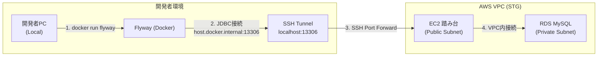

# HwHub Database（hw-hub-database）

Housework Hub（HwHub）の **DB スキーマ管理リポジトリ**です。  
MySQL（Docker）上で開発・検証できるようにしつつ、Flyway によって **スキーマ差分をコードとして管理**します。

---

## 当リポジトリの役割

- **Flyway マイグレーション**（スキーマ作成・変更）
- **開発/テスト用のテストデータ投入**（任意）
- **SchemaSpy による ER 図 / スキーマドキュメント生成**（build 配下に出力）

---

## 技術スタック（DB）

- MySQL 8.x（Docker / docker compose）
- Flyway（Gradle plugin）
- SchemaSpy（Gradle task で出力）

---

## ディレクトリ構成（主要）

```
hw-hub-database/
├── flyway/
│   ├── sql/        # 本番相当のマイグレーション（スキーマ差分）
│   └── sql-test/   # 開発・テスト限定のデータ投入（任意、seedDevData で適用）
├── build/
│   └── schemaspy/  # SchemaSpy の出力（生成物）
└── gradle/
    └── wrapper/
```

> `.gradle/` や `build/` は生成物・キャッシュです（コミット対象外）。

---

## よく使うコマンド

### 1) MySQL（Docker）を起動

プロジェクトルートで：

```bash
docker compose up -d
```

停止する場合：

```bash
docker compose down
```

---

### 2) Flyway（スキーマ）を適用

`flyway/sql` にある **本番相当**のマイグレーションを適用します。

```bash
./gradlew flywayMigrate
```

---

### 3) 開発・テスト用データを投入（任意）

`flyway/sql-test` 配下の **開発・テスト用データ**を追加で適用します。

```bash
./gradlew seedDevData
```

このタスクは以下のように定義されています：

```gradle
tasks.register("seedDevData", org.flywaydb.gradle.task.FlywayMigrateTask) {
    group = "flyway"
    description = "Apply dev/test-only data migrations (flyway/sql-test)."
    dependsOn("flywayMigrate")
    locations = ["filesystem:flyway/sql-test"]
}
```

---

## マイグレーション運用ルール（Flyway）

- 変更は **必ず Flyway の SQL として追加**する（手動 ALTER のみで終わらせない）
- ファイル命名規約（例）
    - `V00_000_001__create_xxx.sql`
    - `V00_000_010__add_column_yyy.sql`
- 既存マイグレーションの「編集」は避け、原則 **新規ファイル追加**とする

---

## SchemaSpy（スキーマ可視化）

SchemaSpy の生成物は `build/schemaspy/` 以下に出力されます。

```bash
./gradlew schemaspy
```

- 出力場所：`build/schemaspy/`
- 生成した HTML をブラウザで開いて確認します

> ※ 実行タスク名はリポジトリの Gradle タスク定義に依存します。  
> もしタスク名が不明な場合は `./gradlew tasks` で確認してください。

---


## STG 環境（AWS RDS）への Flyway 適用手順（運用者向け）

> ⚠️ 本手順は **STG 環境の RDS に対して直接マイグレーションを適用**します。  
> 実行できるのは、以下の条件を満たす運用者に限られます。
>
> - STG 用 EC2 踏み台へ SSH 接続できる`stg.pem`（秘密鍵）を保持していること
>
> いずれかが満たされない場合、実行はできません。

---

### STG 環境への接続経路（構成図）

STG 環境の RDS は Private Subnet に配置されているため、  
ローカル PC から直接接続することはできません。

そのため、以下の経路で Flyway を実行します。

- ローカル PC で Flyway（Docker）を起動
- SSH トンネルを使って EC2 踏み台経由で RDS に接続



---

### 概要

本番相当の STG 環境では RDS は Private Subnet に配置されているため、  
**EC2 踏み台経由の SSH トンネル**を利用してローカルから Flyway を実行します。

実施フローは以下の通りです。

1. EC2 踏み台経由で SSH トンネルを確立
2. ローカル PC から Docker 版 Flyway で RDS に接続
3. `info` で状態確認後、`migrate` を実行

---

### 1) SSH トンネルの確立

EC2 の **パブリック IP は起動のたびに変わる**ため、事前に AWS コンソールで最新の IP を確認してください。

以下は PowerShell / Git Bash の例です。

```powershell
ssh -i stg.pem -N -L 13306:hwhub-mysql-stg.c1o42eyisztt.ap-northeast-1.rds.amazonaws.com:3306 ec2-user@<EC2のパブリックIP>
```

- ローカルの `13306` ポート → STG RDS の `3306` に転送されます
- このターミナルは **Flyway 実行中は閉じないでください**

---

### 2) Docker 版 Flyway の実行

別のターミナルを開き、以下の手順で実行します。

#### 2-1) DB パスワードの設定（例）

```powershell
$DB_PASSWORD = "********"
```

---

#### 2-2) Flyway の状態確認（info）

```powershell
docker run --rm `
  -v "${PWD}\flyway\sql:/flyway/sql" `
  flyway/flyway:10 `
  -url="jdbc:mysql://host.docker.internal:13306/hwhub_db?useSSL=false&characterEncoding=utf8&serverTimezone=Asia/Tokyo&sessionVariables=time_zone='+09:00'" `
  -user="hwhub" `
  -password="$DB_PASSWORD" `
  info
```

---

#### 2-3) マイグレーションの適用（migrate）

```powershell
docker run --rm `
  -v "${PWD}\flyway\sql:/flyway/sql" `
  flyway/flyway:10 `
  -url="jdbc:mysql://host.docker.internal:13306/hwhub_db?useSSL=false&characterEncoding=utf8&serverTimezone=Asia/Tokyo&sessionVariables=time_zone='+09:00'" `
  -user="hwhub" `
  -password="$DB_PASSWORD" `
  migrate
```

#### 2-4) 削除（clean）
基本的に実行しない。
もし実行する場合は `-cleanDisabled=false` を付けてください。

---

### 3) JDBC URL に関する注意（重要）

STG 環境では **MySQL セッションの time_zone を JST に固定**するため、  
JDBC URL には必ず以下のパラメータを含めてください。

```
serverTimezone=Asia/Tokyo
sessionVariables=time_zone='+09:00'
```

これらが無い場合、以下のカラムが **UTC で記録されてしまう事故**が発生します。

- `CURRENT_TIMESTAMP`
- `NOW()`
- `ON UPDATE CURRENT_TIMESTAMP`

---

### 4) 適用結果の確認

RDS 上で以下の SQL を実行し、想定通りのバージョンが適用されていることを確認してください。

```sql
SELECT * FROM flyway_schema_history ORDER BY installed_rank DESC;
```

---

### 注意事項

- 本手順は **STG 環境のスキーマを即時変更**します
- 実行前に必ず以下を確認してください
  - 適用対象の Flyway バージョン
  - SQL の内容
  - 影響範囲
- 原則として、レビュー完了後に実行してください

---

> ※ 本番環境（PROD）への適用手順は、将来 STG 手順をベースに別途定義します。


---

## トラブルシュート

### Flyway が DB に接続できない

- Docker の MySQL が起動しているか確認：`docker ps`
- DB 接続情報（ホスト/ポート/DB名/ユーザー）が Gradle 設定と一致しているか確認

### seedDevData を実行してもデータが入らない

- `flyway/sql-test` の SQL が `V...__...sql` の形式になっているか確認
- 既に同じバージョンが適用済みだと再実行されないため、バージョンを進めてください

---

